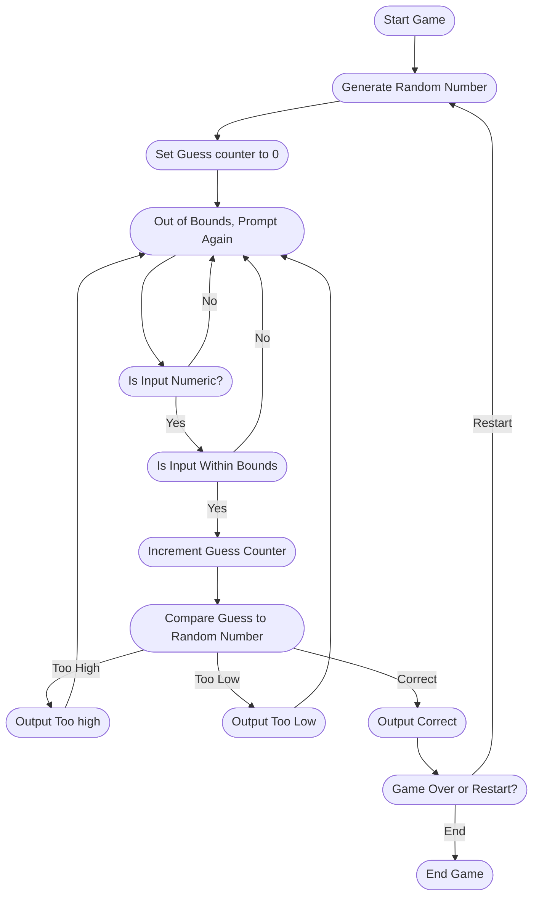

## Guessing Game Process

1)  Start Game: Initialize game and any variables.
2)  Generate Random Number: Generate a random number for the user to try and guess within a predefined range
3)  Set Guess counter to 0: The game will keep track of how many guesses the player makes starting at 0.
4)  Input from User: The system will prompt the user to enter their guess and the user will input a number. 
5)  Verify input: The system will make sure the user's input is a number, if its not than the game will prompt the user to enter a valid guess. 
6)  Is Input within bounds: The game checks whether the input is in the allowed range, if not the game will tell the user.
7)  Increment guess counter: When the User makes a valid guess it will go up by one.
8)  Compare guess to the generated number. The game will give feedback wether its too high, too low, or correct.
9)  Too High: If the guess is greater than the generated number, the game will output "your guess is too high"
10) Too Low: If the guess is lower than the generated number, the game will output "Your guess is too low"
11) Correct: If the guess is the right number, the game will congradulate them with an output like "you guessed correctly"
12) Game over or restart: After a correct guess the game will prompt the user to either restart the game or end it. If the user restarts then a new random number will generate and resets the guess counter.
13) End Game: If the user chooses to end the game or the guess limit is reached, the game ends.